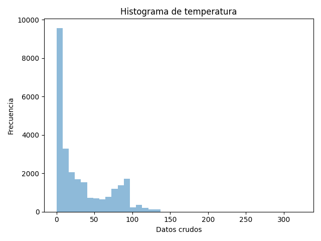
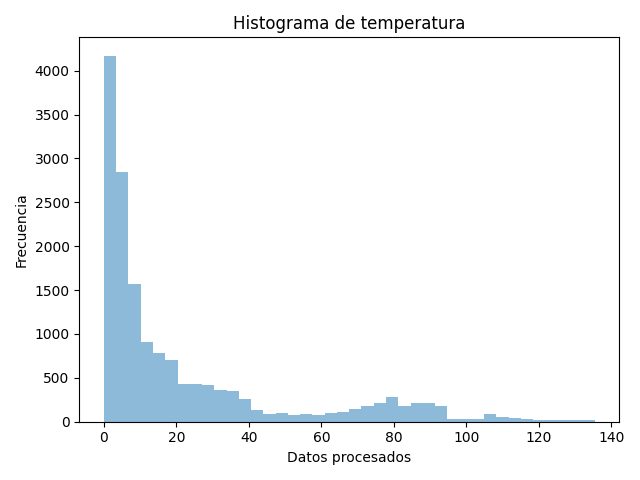
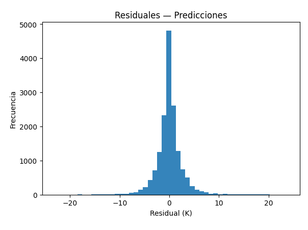
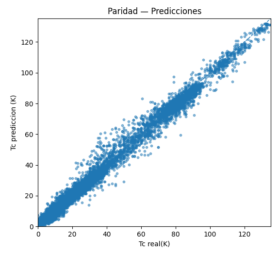
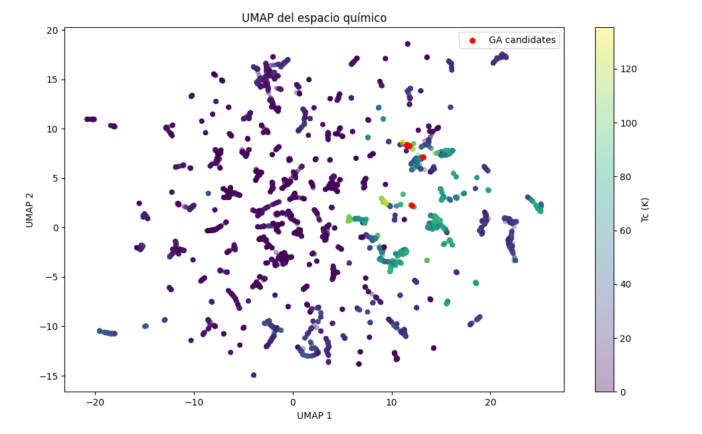

# Prediction and Inverse Design of Superconductors Using Random Forest

## Description
This project focuses on predicting the critical temperature (Tc) of superconductors using atomic composition data and machine learning models. It also explores inverse design strategies to propose candidate compositions for a target Tc.

## Objectives
- Predict superconducting critical temperature from atomic compositions.
- Train and evaluate Random Forest models.
- Perform inverse design using optimization techniques.

## Input Data
The model uses normalized atomic fractions as input features and Tc as the target variable.

## Methodology
1. Data cleaning and normalization.
2. Feature-target split.
3. Random Forest model training.
4. Model evaluation using regression metrics.
5. Inverse design through optimization.

## Repository Structure
- `data/`: datasets, available after publication
- `Chemical_domain/`: chemical space of dataset utility functions and 
- `GA/`: genetic algorithm for reverse design
- `models/`: trained models
- `Results/`: figures and outputs
- `Funciones_Superconductores.py`:functions to data cleaning, normalization, plots and metrics 
- `RF_Supercon.py`: model scripts 
## Usage
**Train the model:**

python RF_Supercon.py

**Run inverse design:**

python GA_results.py

**RF results:**

python Results.py

## Results

## Author
Luis Ram
PhD student in Chemical Engineering Sciences